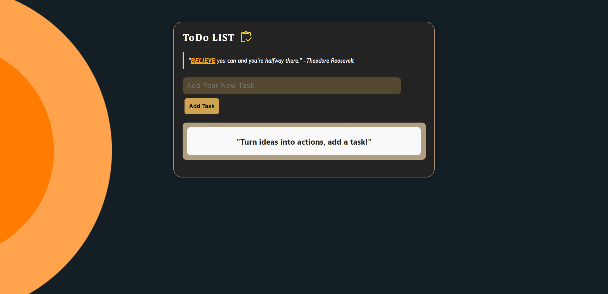

# ToDO LIST
---
## Overview
My ToDO LIST Project is a web application for managing daily tasks and to-do lists.

## Getting Started
* Clone the repository: `https://github.com/VishalValvi-83/todolist-app`
* Install dependencies: `npm install`
* Start the development server: `npm start`

## Features
* Create, edit, and delete tasks
* Track progress and set reminders

## Site View

## Contributing
Contributions welcome! Fork, create a new branch, make changes, and create a pull request.

## Authors
* [Vishal Valvi](https://github.com/username) - Creator and maintainer